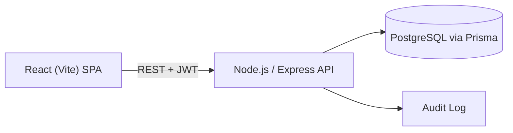

# Secure DevSecOps Issue Tracker

A small, fully-working, production-style issue tracker built to demonstrate practical full-stack development **and** application security engineering: JWT auth, server-enforced RBAC, input validation, audit logging, and secure HTTP configuration — end to end.

> Built as a portfolio / interview project. Every feature listed below is implemented and runnable, not a mock.

## Architecture



See [`docs/SECURITY_ARCHITECTURE.md`](docs/SECURITY_ARCHITECTURE.md) for the detailed request lifecycle and sequence diagrams.

## Features

- Email/password auth with bcrypt hashing and JWT sessions
- Role-Based Access Control: `ADMIN`, `DEVELOPER`, `VIEWER` — enforced server-side
- Full issue CRUD with severity, priority, status, category, assignment
- Search, filter (status/severity/category), and pagination
- Admin dashboard: user management (create/change role/delete) and audit log viewer
- Security-event audit logging (logins, role changes, issue lifecycle events)
- Helmet security headers + CSP, explicit CORS allow-list, rate limiting, centralized error handling, Zod input validation

## Technology Stack

| Layer | Tech |
|---|---|
| Frontend | React 18, Vite, React Router |
| Backend | Node.js, Express |
| Database | PostgreSQL, Prisma ORM |
| Auth | JWT, bcrypt |
| Infra | Docker, Docker Compose |
| Testing | Jest, Supertest |

## Security Controls

See [`SECURITY.md`](SECURITY.md) for full detail. Summary: bcrypt password hashing, JWT with expiry, server-side RBAC on every mutating route, Zod validation on all input, Prisma parameterized queries (no raw SQL), Helmet + CSP, explicit CORS origin, per-endpoint rate limiting, centralized error handling that never leaks internals, and a full audit trail of security-relevant events.

## Database Design

Three core tables — `User`, `Issue`, `AuditLog` — with foreign keys, indexes on frequently-queried columns (`status`, `severity`, `category`, `role`, etc.), and `createdAt`/`updatedAt` timestamps. Full schema: [`backend/prisma/schema.prisma`](backend/prisma/schema.prisma).

## API Overview

```
POST   /api/auth/register
POST   /api/auth/login
GET    /api/auth/me

GET    /api/users            (ADMIN)
POST   /api/users            (ADMIN)
PATCH  /api/users/:id        (ADMIN)
DELETE /api/users/:id        (ADMIN)

GET    /api/issues           (any authenticated role)
GET    /api/issues/stats     (any authenticated role)
GET    /api/issues/:id       (any authenticated role)
POST   /api/issues           (ADMIN, DEVELOPER)
PATCH  /api/issues/:id       (ADMIN, DEVELOPER)
POST   /api/issues/:id/assign(ADMIN, DEVELOPER)
DELETE /api/issues/:id       (ADMIN)

GET    /api/audit-logs       (ADMIN)
```

## Project Structure

```
secure-devsecops-issue-tracker/
├── backend/
│   ├── src/
│   │   ├── controllers/     # request handlers
│   │   ├── routes/          # Express routers + RBAC wiring
│   │   ├── middleware/      # auth, validation, rate limiting, errors
│   │   ├── services/        # audit logging
│   │   ├── validation/      # Zod schemas
│   │   └── lib/             # env, prisma client, jwt helpers
│   ├── prisma/               # schema + seed script
│   └── tests/                 # Jest/Supertest integration tests
├── frontend/
│   └── src/
│       ├── pages/            # Login, Register, Dashboard, Issues, Admin*
│       ├── components/       # Layout, ProtectedRoute
│       ├── context/           # AuthContext
│       └── api/               # fetch client
├── docs/
│   ├── SECURITY_ARCHITECTURE.md
│   └── INTERVIEW_GUIDE.md
├── docker-compose.yml
├── .env.example
├── SECURITY.md
└── README.md
```

## Environment Setup

```bash
cp .env.example .env
# edit .env — at minimum set a real JWT_SECRET (openssl rand -base64 48)
```

## Local Development

Requires Node.js 20+ and a running PostgreSQL instance (or use Docker Compose for just the database: `docker compose up postgres`).

```bash
# Backend
cd backend
npm install
npx prisma migrate dev
npm run seed
npm run dev            # http://localhost:4000

# Frontend (separate terminal)
cd frontend
npm install
npm run dev            # http://localhost:5173
```

## Docker Setup

```bash
docker compose up --build
```

This starts `postgres`, `backend` (which runs `prisma migrate deploy` automatically on boot), and `frontend` (served via nginx). Then seed demo data once:

```bash
docker compose exec backend npm run seed
```

- Frontend: http://localhost:5173
- Backend API: http://localhost:4000/api

## Testing

```bash
cd backend
npm test
```

Covers: registration, login (success/failure), missing/invalid/expired JWT, viewer/developer attempting unauthorized operations, authorized issue creation, IDOR/BOLA protection, and input validation failures.

## Example / Demo Credentials

Seeded by `npm run seed` — for local development only, never use in production:

## Security Considerations

See [`SECURITY.md`](SECURITY.md) for the full threat model, mitigations, and known limitations (e.g. JWT storage in `localStorage`, no MFA, no refresh-token rotation).

## Future Improvements

- httpOnly cookie + CSRF-protected auth instead of `localStorage` JWTs
- MFA for admin accounts
- CI pipeline with dependency scanning and automated test runs
- Redis-backed distributed rate limiting
