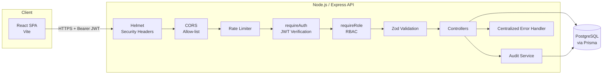
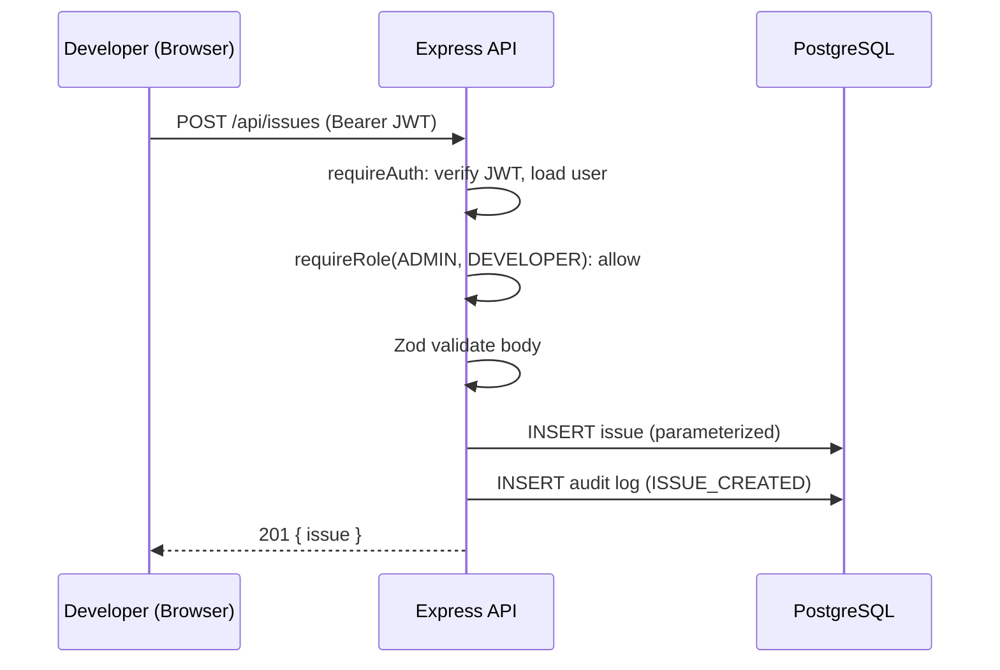

# Security Architecture

## High-Level Diagram

## Request Lifecycle

1. **Helmet** attaches security headers to every response before anything else runs.
2. **CORS** rejects any request from an origin other than the configured `FRONTEND_URL`.
3. **Rate limiting** throttles abusive clients per-IP before hitting business logic.
4. **requireAuth** verifies the JWT signature/expiry and re-fetches the current user record (catches deleted/role-changed accounts even mid-token-lifetime).
5. **requireRole** enforces RBAC — the actual authorization boundary — per route.
6. **Zod validation** rejects malformed input before it reaches a controller or the database.
7. **Controllers** perform the operation using Prisma (parameterized queries only) and, for sensitive actions, write an **audit log** entry.
8. Any thrown error is caught by the **centralized error handler**, which returns a safe, generic message to the client while logging full details server-side.

## Data Flow: Issue Creation Example

## Trust Boundaries

- **Browser → API**: untrusted. Every input is re-validated and re-authorized server-side; the frontend's route guards and hidden buttons are UX only.
- **API → Database**: trusted, but all queries go through Prisma's parameterized query layer — no string-built SQL.
- **API → Audit Log**: append-only from the API's perspective; only `ADMIN` can read it back through the API.
